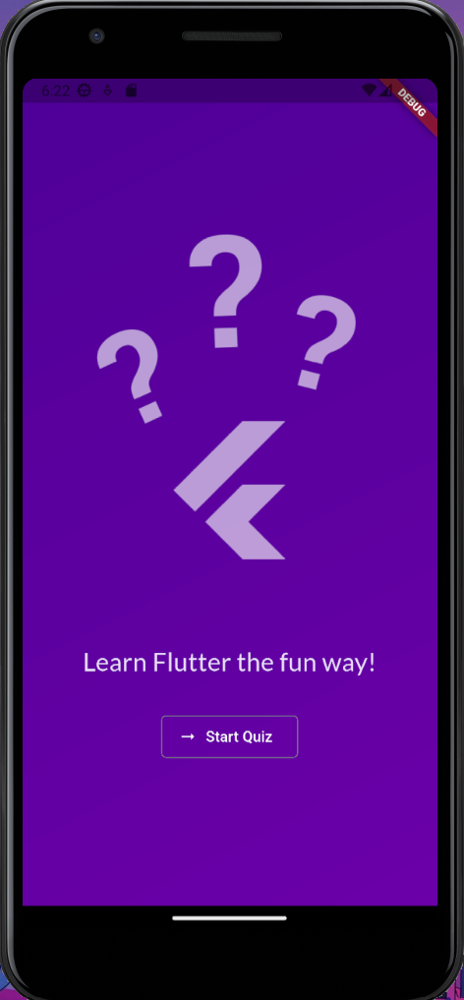
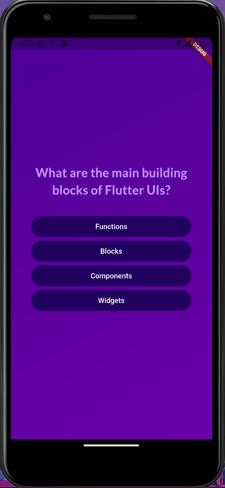
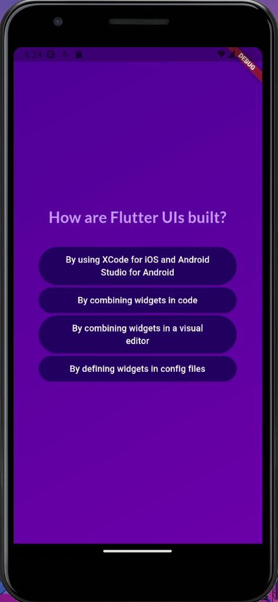
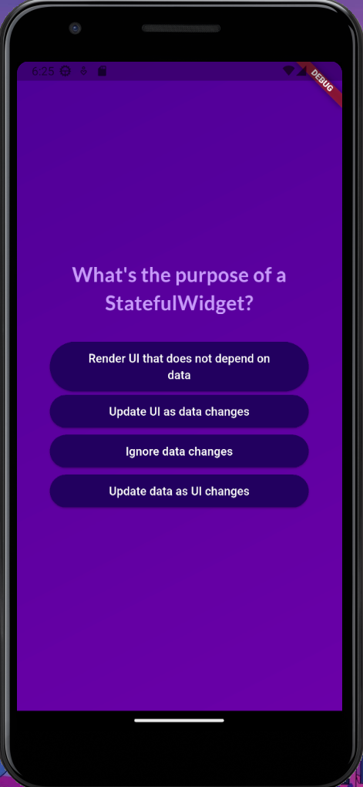
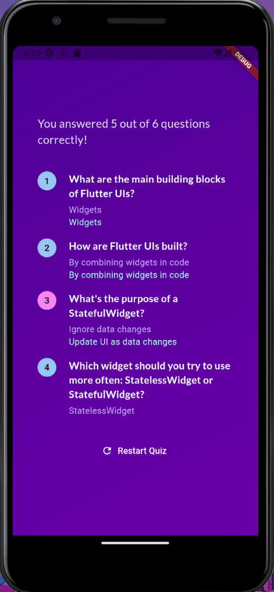
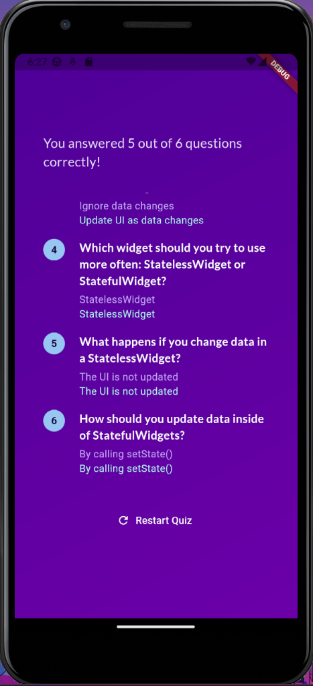

# QUIZ_APP

Mobile application developed with **Flutter and Dart** as a quiz application project.  
The app presents multiple-choice questions, allows users to select answers, tracks their progress, and displays a final summary with the results.

## Preview

<table>
<tr>
  <td></td>
  <td></td>
  <td></td>
</tr>
<tr>
  <td></td>
  <td></td>
  <td></td>
</tr>
</table>

## Features
- Multiple-choice quiz questions
- Randomized answer order
- Answer selection tracking
- Dynamic screen navigation
- Final results summary
- Correct and incorrect answer indicators
- Custom fonts using Google Fonts
- Responsive and clean user interface

## Technologies
- Flutter
- Dart
- Google Fonts
- Android

## Test Device

- **Device:** Pixel 3a API 33 x86_64
- **Operating System:** Android 13 (Tiramisu)

## Installation

1. Clone the repository:
   ```bash
   git clone https://github.com/IsaPortuguez/Quiz_App.git

2. Navigate to the project directory:

    ```bash
    cd quiz_app

3. Install dependencies:

    ```bash
    flutter pub get

4. Run the application:

    ```bash
    flutter run

## Usage
- Press the start button to begin the quiz.
- Select an answer for each question.
- Navigate through all available questions.
- Review the final summary to see:
  - Selected answers
  - Correct answers
  - Question results
- Press the restart button to restart the quiz.

## Project Structure

```text
QUIZ_APP/
├── assets/
│   └── images/                         # Images used by the app
│   └── screenshots/                    # Images for the README
├── lib/                                # Main application code
│   ├── data/
│   │   └── questions.dart              # Quiz questions data
│   ├── models/
│   │   └── quiz_question.dart          # QuizQuestion data model
│   └── questions_summary/
│       └── question_identifier.dart    # Correct/incorrect question indicator
│       ├── questions_summary.dart      # Displays quiz summary list
│       ├── summary_item.dart            # Individual question result item
│   ├── answer_button.dart              # Reusable answer button widget
│   ├── main.dart                       # Application entry point
│   ├── questions_screen.dart           # Questions and answer selection screen
│   ├── quiz.dart                       # Quiz state management and screen switching
│   ├── results_screen.dart             # Final results screen
│   ├── start_screen.dart               # Initial quiz screen
├── android/                            # Native Android code
├── ios/                                # Native iOS code
├── linux/                              # Linux support
├── macos/                              # macOS support
├── web/                                # Web support
├── windows/                            # Windows support
├── test/                               # Automated tests
│   └── widget_test.dart
├── .gitignore                          # Files ignored by Git
├── pubspec.yaml                        # Dependencies and configuration
└── README.md                           # Project documentation
```

## Project Status

✅ Completed (learning project)

## Author

Developed by Isabel Portuguez Calderon
GitHub: https://github.com/IsaPortuguez

## Notes 

This project was created for educational purposes as an introduction to mobile app development using Flutter.

## Acknowledgements

This app was created following a course on Udemy:  
[Flutter & Dart - The Complete Guide [2025 Edition]](https://www.udemy.com/course/learn-flutter-dart-to-build-ios-android-apps/)

Special thanks to the instructor for the guidance.

## Resources

If you're new to Flutter, these resources might help you:

- [Write your first Flutter app](https://docs.flutter.dev/get-started/codelab)
- [Flutter Cookbook](https://docs.flutter.dev/cookbook)
- [Flutter Documentation](https://docs.flutter.dev/)
